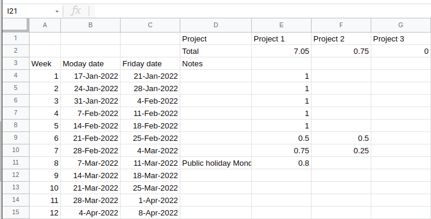
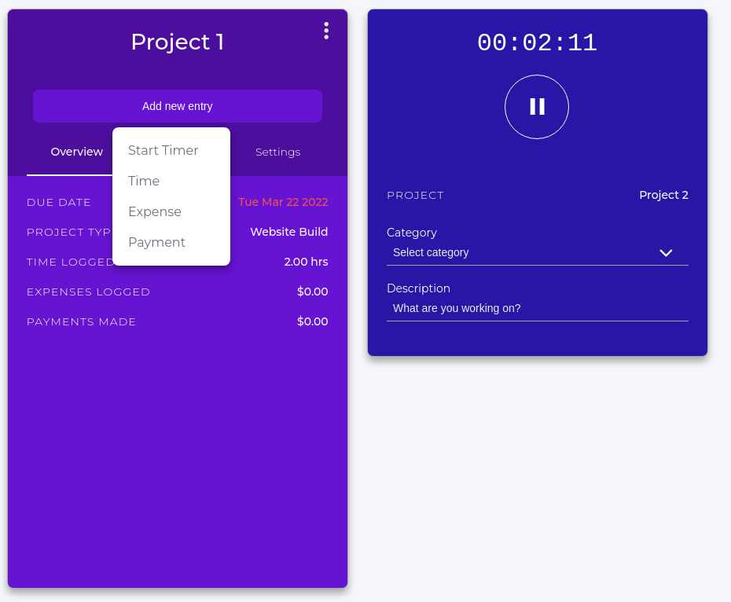

# Project management
The goal of project management is to make it easier to understand the work that needs to be done, track the progress of individual work items, to reduce the communications overhead, and to increase productivity of all involved.
By applying project management strategies to your work you can expect to get more work done with your limited resources, have a clearer view of the current state of your projects, and be able to collaborate with others more effectively.

> ## Discussion
> Have you ever experienced any of the following?
> - Struggling to find the email with the plot you want to share in a meeting
> - Not being sure if you have the most up to date version of a document
> - Struggling to keep track of your tasks
> - Forgetting deadlines
> - Taking on too much work so you can’t work on *your* project
> - Struggling to keep track of who was assigned to a task
> - Being unsure who is doing the task that is blocking your current work
> - Having meetings that involve updates on tasks but no helpful discussions
>
> In small groups share you experience and potential solutions to some of the above situations.
> Choose one issue and solution and add it to our shared document.
{: .discussion}

## Project management basics
The two main project management styles that are applied in software development, business, and research are waterfall and agile.
The two styles represent different ends of a flexibility spectrum.

In the **waterfall** mindset there is a very linear approach to the design and execution and delivery of the project with the main focus being on compliance and following a set process.
This works well in situations that are very risk averse, or have a large amount of external oversight.
You'll see waterfall style project management in large projects like instrument development, construction, and commissioning.

Due to the rigid design of waterfall managed projects, the work requirements are often visualised in a Gantt chart such as the one below:

|                      {: .width="400"}                      |
| :-----------------------------------------------------------------------------------------------------------------------------------------------------------------: |
| The waterfall management style gets it's name from the fact that work items are completed in a linear fashion with a cascading dependency chart such as that above. |

With a **agile** mindset the main focus is on outcomes and deliverables, with the design and execution and delivery occurring in cycles.
An agile approach works well in situations where the path to completion is not well defined, or where resources or requirements are liable to change throughout the project.
Without knowing it you will probably already be engaged in a very agile-like approach to your research projects simply because so much of your work is likely to be exploratory in nature.

|                     {: .width="800"}                     |
| :---------------------------------------------------------------------------------------------------------------------------------------------------------------: |
| In a research context, an agile approach is all about exploring and responding to change (discoveries). You don't know the outcome of your work before you start. |

A common tool for visualizing and tracking work, particularly in an agile process, is the kanban board.
The Kanban board was initially as a physical pin board on which cards or sticky notes were used to represent tasks.
The tasks are organized into columns based on their status, and would typically migrate left to right across the board.
Columns are customized for each project, but there are typically no more than 4-5.
If a board is tracking multiple projects, or a project has multiple deliverables, then the board can also be divided horizontally into swimlanes.
As the name suggests, tasks can move within a swimlanes, but are not intended to change lanes.

| {: .width="800"} |
| :----------------------------------------------------------------------------------: |
|             An example of a Kanban board with 5 columns and 3 swimlanes              |

> ## Design a board
> Think of a project that you are currently working on and design a Kanban board for it.
> Consider the following:
> - How many task status categories are needed and what do you label them.
> - Could you get away with fewer categories?
> - Would it be useful to divide your tasks into different swimlanes, and if so how?
> - What tasks could you put in each category right now?
>
> Using a simple markdown format create a table in our shared document that shows the categories (and swimlanes if used) that you would use for your project.
> If you have time include some example tasks.
> (See the example table).
>
{: .challenge}

Cards have a lot of features that you can play with.
Some of the immediately useful ones include:
- a due date
- embedded check lists for incremental tasks
- customizable coloured labels
- attachments
- The ability to use markdown to format the text of the card
- A chat/discussion space

|  |
| :--------------------------------------------------------------------------------------------------------: |
|                     An example of some of the features that you can add to your cards                      |

### Online Kanban with Trello
Trello is one of the most popular project management applications thanks to it being easy to use, flexible, and free.

If you have not already, create a Trello account [here](https://trello.com/).

Trello organizes your tasks by workspaces and boards.
Tasks that relate to a project are grouped into the same boards, and then multiple related boards are grouped into a workspace.
For example you may have a different board for each of your research projects, but then group them together based on your collaborations.
If you are doing a PhD then you’ll probably just need a single board for your PhD, and a single workspace to hold that board.
As an early career researcher you’ll probably have a workspace that is something like "my astro work", which then has a different board for each of the projects that you are involved in.
Many people find it useful to also have a "personal" or "home life" board that they use to track non-work related activities.
These are good people.

Trello uses a Kanban board to track tasks for each of your boards, and this is the default visualization that you’ll see when you create a board.
The different columns within a board are referred to as "lists" and items within the list are "cards".
You will have the freedom to create/rename/delete the lists as you see fit, and to move cards between lists as they move through the to-do/doing/done phases that you define.

Now that we have that nomenclature out of the way, lets get started with our Trello accounts.

> ## Create a board with some dummy cards
> - Create a new workspace
> - Within that workspace create a new board
> - Within that board create three columns "todo", "doing", and "done"
> - Within the "todo" column create a new card
> - Set the title of the card to be something like "Create a card"
> - Move the card into the "doing" column
> - Add yourself as a member of the card
> - Add a short description to the card
> - Move the card to the "done" column
>
> Pat yourself on the back for a job well done.
{: .challenge}

## Time management
Part of managing a project is realising that time is a very limited resource so it is often beneficial to manage it to the best of your abilities. You can split time management into two main catagories, prosepctive (planning) and retrospective (tracking).

A common way of estimating time projects will take is to work in hours/days/weeks/months of effort.
However you are often not working on a single task at a time so it can be easier to break your total time available (your Full-Time Equivalent or FTE), into fractions, and then assign these fractions to different tasks.
By estimating and tracking your FTE over the course of a project you can ensure that you are not spread too thin and you can finish tasks on time.
Effective time management will prevent you from taking on more work than you can realistically complete.

For example, someone asks you to help with a project.
You look at your project planning app and see that you have two projects you aim to spend 0.4 FTE on and a third you aim to spend 0.2 FTE on.
Since this fills up the entire 1.0 FTE, you let them know that you can not assist on their project.
You know that your third project will be complete in a month, so you offer to provide help at the level of 0.2 FTE starting in a month.

Deciding where you spend your FTE is only half the battle.
You must also track your time to ensure that you are staying on budget, and adjusting if required.
Tracking your time can be done through several apps ([see the following section](#how-to-track-your-time)) and should give you at least a rough estimate of the time you spend on each project.
This basic information will allow you to see how much time tasks and projects take and improve your future estimates.
For example, you estimated that it would take you a month to write the first chapter of your thesis, but it took six weeks.
You now know to budget more time for the next chapter.
Another example is that you budget 0.5 FTE for teaching, but you realize you are using 0.6 FTE, so you will have to cut back on other projects.

## How to track your time
There is a large variety of time tracking techniques and software available to help you track your time.
Probably the most useful for academic work is an online or mobile app.
Some time tracking apps are feature rich with all kinds of integrations and billing options, however they can come with a large time overhead which can be counter productive.
If you are spending more than 10 minutes per day tracking your time, it is unlikely to be worth the effort, so we will focus on simple time tracking methods.

### Excel method
[Here](https://docs.google.com/spreadsheets/d/1SGGcZE7vZULR72iWkuvSsmgca2sCJEu9CWxWDEVF2L0/edit?usp=sharing) is a link to a simple Google Sheets template (shown below) of an easy way to track how much time you spend per week on several projects.
At the end of each week, you update the sheet to track the fraction of your time you spent on each project.
Additional projects can be added easily as new columns.
This is effective for when you only care about your fractional FTE at a fairly low resolution.

### Chronos app
[Chronos](https://app.chronostimetracking.com/) is a simple app that will allow you to keep track of your project time.
Simply make a new project with a descriptive name and set the billing type to non-billable.
You can start a timer for the project you are currently working on or manually add how many hours you have spent.
This method is good for when you have many projects that you are swapping between throughout the day, or when you want to be able to track your 'effective' work hours within a week.

> ## How do you spend your time?
> Think about the work that you do as part of your research.
> - Itemize the projects/work that you do (up to 10 max)
> - For each item how much time you want to spend on it
> - For each item estimate how much you *think* you spend on it
> - Use our shared document to comment on why these last two might be different
>   
> Consider:
> - Of the three methods described for time tracking which would be more useful to you
> 
{: .challenge}

## "Owning" your project
Your PhD and research career is a story in progress and you are the hero protagonist.
As with any good story, the hero goes through an arc of personal development.
For you, this will likely be a progression from being led by your supervisor in a project that they conceived to being the expert in an area and being the main driver of your research.
You will likely start out turning up to meetings that your supervisor calls, doing what you are told, reading all the suggested readings, and relying on your supervisor for the "next steps".
Eventually you will turn up to meetings that you organize, deciding on what your project goals are and how you'll progress toward them, and handing out todo items at the end of a meeting.
This is what we call "owning" your project, and when it happens you'll feel less like an imposter, and more in control of your work (and life!).
When your supervisor or mentor sees this transition is also very rewarding for them!

Much of the above will come naturally with time, but there are things that you can start thinking about now that will help you own your project now.
Some key owning behaviors include:
- Setting clear expectations for what work needs to be done, including deadlines
  - Let people know how much time you have to work on something and when you expect it to be complete
- Clear communication on progress, including any risks or slippages
  - Let people know when you complete tasks or if there are road blocks
- Taking the lead on project ideas
  - You don't have to have all the solutions, but making suggestions and asking the right questions is extremely helpful to everyone
- Having meeting agendas and showing up to meetings with all the information that you need
  - Send plots/text ahead of time for review, have the relevant files/pages open on your laptop ready to share

> ## Discussion - how do/will you own your project
> Think about the relationship you have with your group/supervisor
> - Identify an owning behavior that you are already doing
> - Identify an issue that you have and would like some advice with
> - Identify something that you are currently doing that has avoided some of the problems that we started the lesson with [link](#discussion)
> 
> Share your ideas in our shared document
{: .discussion}

